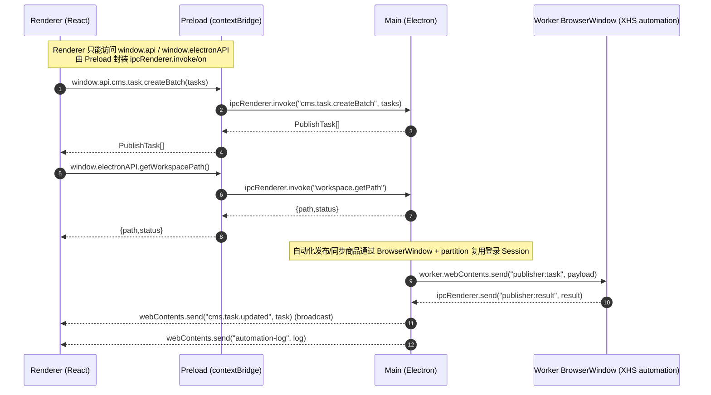

# Super CMS 技术架构文档

> 本文档基于当前代码库“按实际实现”整理：如果需求结构中提到的文件/模块在仓库内不存在，文档会明确标注并指向实际对应实现位置。

## 1. 技术栈概览 (Tech Stack)

* **Core**: Electron (Main/Renderer Process), Node.js
* **Frontend**: React, TypeScript, Tailwind CSS, Shadcn/UI (Radix)
* **State Management**: Zustand (useCmsStore)
* **Storage**: lowdb (JSON based), fs-extra
* **Image Processing**: sharp
* **Layout**: react-resizable-panels

### 1.1 实际依赖与入口（代码事实）

* Electron 三端入口：
  * Main： [index.ts](file:///Users/z/TraeBase/Project/CMS-2.0/src/main/index.ts)
  * Preload： [preload/index.ts](file:///Users/z/TraeBase/Project/CMS-2.0/src/preload/index.ts)
  * Renderer： [main.tsx](file:///Users/z/TraeBase/Project/CMS-2.0/src/renderer/src/main.tsx) → [App.tsx](file:///Users/z/TraeBase/Project/CMS-2.0/src/renderer/src/App.tsx)
* Build：electron-vite（见 [package.json](file:///Users/z/TraeBase/Project/CMS-2.0/package.json) scripts）
* UI 组件：存在 `src/renderer/src/components/ui`（shadcn 风格目录）；依赖里显式包含 `@radix-ui/react-slot`，未看到完整 Radix 组件集合（见 [package.json](file:///Users/z/TraeBase/Project/CMS-2.0/package.json#L25-L54)）。
* 状态管理：Zustand store 为 [useCmsStore.ts](file:///Users/z/TraeBase/Project/CMS-2.0/src/renderer/src/store/useCmsStore.ts)。
* 存储：仓库内未发现 `lowdb` / `fs-extra` 的实际使用；工作区持久化为 `electron-store` 写入 `${workspacePath}/db.json`（见 [db.ts](file:///Users/z/TraeBase/Project/CMS-2.0/src/main/services/db.ts#L137-L163)）。
* 图像处理：sharp 用于 ImageLab 与裂变图片变异（见 [index.ts](file:///Users/z/TraeBase/Project/CMS-2.0/src/main/index.ts#L638-L958) 与 [imageMutator.ts](file:///Users/z/TraeBase/Project/CMS-2.0/src/main/services/imageMutator.ts#L39-L76)）。
* 布局：媒体矩阵排期页使用 react-resizable-panels（见 [CalendarView.tsx](file:///Users/z/TraeBase/Project/CMS-2.0/src/renderer/src/modules/MediaMatrix/CalendarView.tsx#L444-L629)）。

## 2. 系统架构图 (System Architecture)

### 2.1 主/渲染进程交互（Mermaid）



### 2.2 IPC 关键通道（按实际代码）

* 主进程注册集中在：[index.ts](file:///Users/z/TraeBase/Project/CMS-2.0/src/main/index.ts#L367-L1312) 与 [publisher.ts](file:///Users/z/TraeBase/Project/CMS-2.0/src/main/publisher.ts#L464-L624)。
* 预加载侧统一暴露在：[preload/index.ts](file:///Users/z/TraeBase/Project/CMS-2.0/src/preload/index.ts#L27-L266) 与类型声明：[preload/index.d.ts](file:///Users/z/TraeBase/Project/CMS-2.0/src/preload/index.d.ts#L1-L217)。

## 3. 数据模型设计 (Data Schema)

> 事实对齐：仓库内不存在 `src/shared/types/index.d.ts`（当前路径下无 `src/shared` 目录）。类型定义分散在：预加载 `index.d.ts`、主进程 `taskManager.ts`、渲染侧 `useCmsStore.ts` 等处。本文按“真实运行链路中的类型”说明。

### 3.1 任务模型（Publish Task：媒体矩阵/自动发布链路）

该类型同时在主进程与预加载声明中出现（字段一致），用于 `window.api.cms.task.*` 的输入输出：

* 主进程：`PublishTask` / `PublishTaskStatus`：[taskManager.ts](file:///Users/z/TraeBase/Project/CMS-2.0/src/main/taskManager.ts#L11-L32)
* 预加载：`CmsPublishTask` / `CmsPublishTaskStatus`：[preload/index.d.ts](file:///Users/z/TraeBase/Project/CMS-2.0/src/preload/index.d.ts#L23-L42)

#### TaskStatus（发布任务状态）

```ts
type CmsPublishTaskStatus =
  | 'pending'
  | 'processing'
  | 'failed'
  | 'publish_failed'
  | 'draft_saved'
  | 'scheduled'
  | 'published'
```

#### Task（发布任务）

```ts
type CmsPublishTask = {
  id: string
  accountId: string
  status: CmsPublishTaskStatus
  images: string[]
  title: string
  content: string
  tags?: string[]
  productId?: string
  productName?: string
  publishMode: 'draft' | 'immediate'
  isRaw?: boolean
  scheduledAt?: number
  publishedAt: string | null
  errorMsg: string
  errorMessage?: string
  createdAt: number
}
```

#### TaskStats

* 代码库内未发现 `TaskStats` 的类型/实现（全文检索无匹配）。因此当前系统并没有一个“统一维护的任务统计结构”；统计多由 UI/业务逻辑在运行时计算（例如筛选未排期任务池：[CalendarView.tsx](file:///Users/z/TraeBase/Project/CMS-2.0/src/renderer/src/modules/MediaMatrix/CalendarView.tsx#L154-L157)）。

### 3.2 任务模型（Renderer Store Task：旧/工具链路）

渲染端 Zustand Store 另有一个 `Task/TaskStatus`，与发布任务模型不同（更像“上传/处理任务”的 UI 状态）：

* [useCmsStore.ts](file:///Users/z/TraeBase/Project/CMS-2.0/src/renderer/src/store/useCmsStore.ts#L3-L14)

```ts
export type TaskStatus = 'idle' | 'uploading' | 'success' | 'error'

export interface Task {
  id: string
  title: string
  body: string
  assignedImages: string[]
  status: TaskStatus
  log: string
}
```

建议在团队协作时将该类型显式命名为 `UploadTask`/`UiTask` 等以减少歧义；但本文仅描述现状，不改动实现。

### 3.3 db.json 存储结构

#### db.json 的位置与创建

* 工作区路径由 `WorkspaceService` 管理，并通过 IPC 提供给渲染进程（见 [index.ts](file:///Users/z/TraeBase/Project/CMS-2.0/src/main/index.ts#L243-L270) 与 `workspace.*` handlers）。
* 工作区数据库文件固定为 `${workspacePath}/db.json`：初始化逻辑见 [db.ts](file:///Users/z/TraeBase/Project/CMS-2.0/src/main/services/db.ts#L96-L163)。

#### db.json 的 keys（WorkspaceDbShape）

实际默认结构（并非 lowdb，而是 electron-store 的 JSON 持久化）：

```ts
export type WorkspaceDbShape = {
  accounts: unknown[]
  xhs_tasks: unknown[]
  xhs_products: unknown[]
}
```

* `accounts`：账号记录（由 `AccountManager` 写入/读取）
* `xhs_tasks`：发布任务列表（见 `TaskManager` 中对 `xhs_tasks` 的读写）
* `xhs_products`：商品记录（由 `ProductManager` 写入/读取）

#### NAS 锁问题（EBUSY/EPERM）与重试

* 为适配 NAS/网络盘写入锁冲突，`electron-store` 的 `set/delete/clear` 与首次 `db.json` 创建写入均做了最多 3 次重试 + 随机退避（100~500ms）：[db.ts](file:///Users/z/TraeBase/Project/CMS-2.0/src/main/services/db.ts#L36-L94)

## 4. 核心模块实现原理 (Deep Dive)

### 4.1 混合渲染与 IPC 通信

#### 4.1.1 Renderer 如何调用 Main（window.api / window.electronAPI）

* Renderer 侧通过预加载暴露的 `window.api` 与 `window.electronAPI` 调用后端能力：
  * 暴露点：[preload/index.ts](file:///Users/z/TraeBase/Project/CMS-2.0/src/preload/index.ts#L268-L284)
  * 类型声明：[preload/index.d.ts](file:///Users/z/TraeBase/Project/CMS-2.0/src/preload/index.d.ts#L212-L217)
* `window.api`：业务 IPC（账号/商品/发布任务/队列/日志订阅等）
* `window.electronAPI`：通用能力（对话框、工作区、配置、文件导出/删除、图像处理任务等）
* `window.electron`：来自 `@electron-toolkit/preload` 的基础 Electron API 封装（工具包能力）

调用模式遵循 Electron 安全惯例：

1. Main 通过 `ipcMain.handle(channel, handler)` 注册可调用的能力；
2. Preload 通过 `ipcRenderer.invoke(channel, payload)` 封装为 Promise API 暴露到 Renderer；
3. Renderer 调用 `window.api.*` 获取结果或订阅事件。

#### 4.1.2 所有 IPC Channel 定义（按代码枚举）

> 说明：下面表格只包含“字符串 channel”，并按方向分组；源码以主进程注册为准。

| Channel | 类型 | 方向 | 语义/用途 | 定义位置 |
|---|---|---|---|---|
| `GET /accounts` | handle | Renderer→Main | 获取账号列表 | [index.ts](file:///Users/z/TraeBase/Project/CMS-2.0/src/main/index.ts#L367-L380) |
| `POST /accounts` | handle | Renderer→Main | 创建账号 | [index.ts](file:///Users/z/TraeBase/Project/CMS-2.0/src/main/index.ts#L371-L375) |
| `POST /login-window` | handle | Renderer→Main | 打开登录窗口（带 partition） | [index.ts](file:///Users/z/TraeBase/Project/CMS-2.0/src/main/index.ts#L376-L381) |
| `cms.account.checkStatus` | handle | Renderer→Main | 检查登录状态 | [index.ts](file:///Users/z/TraeBase/Project/CMS-2.0/src/main/index.ts#L382-L386) |
| `cms.account.rename` | handle | Renderer→Main | 重命名账号 | [index.ts](file:///Users/z/TraeBase/Project/CMS-2.0/src/main/index.ts#L387-L392) |
| `cms.account.delete` | handle | Renderer→Main | 删除账号（并联动清理任务） | [index.ts](file:///Users/z/TraeBase/Project/CMS-2.0/src/main/index.ts#L393-L401) |
| `cms.product.list` | handle | Renderer→Main | 列表查询商品 | [index.ts](file:///Users/z/TraeBase/Project/CMS-2.0/src/main/index.ts#L403-L412) |
| `cms.product.save` | handle | Renderer→Main | 保存商品列表 | [index.ts](file:///Users/z/TraeBase/Project/CMS-2.0/src/main/index.ts#L413-L416) |
| `cms.product.sync` | handle | Renderer→Main | 触发从 XHS 自动化同步商品 | [index.ts](file:///Users/z/TraeBase/Project/CMS-2.0/src/main/index.ts#L417-L421) |
| `cms.task.createBatch` | handle | Renderer→Main | 批量创建发布任务 | [index.ts](file:///Users/z/TraeBase/Project/CMS-2.0/src/main/index.ts#L423-L450) |
| `cms.task.list` | handle | Renderer→Main | 按账号列出发布任务 | [index.ts](file:///Users/z/TraeBase/Project/CMS-2.0/src/main/index.ts#L451-L454) |
| `cms.task.updateBatch` | handle | Renderer→Main | 批量更新任务（支持 patches） | [index.ts](file:///Users/z/TraeBase/Project/CMS-2.0/src/main/index.ts#L455-L471) |
| `cms.task.cancelSchedule` | handle | Renderer→Main | 批量取消排期（scheduledAt=null） | [index.ts](file:///Users/z/TraeBase/Project/CMS-2.0/src/main/index.ts#L473-L477) |
| `cms.task.deleteBatch` | handle | Renderer→Main | 批量删除任务 | [index.ts](file:///Users/z/TraeBase/Project/CMS-2.0/src/main/index.ts#L479-L483) |
| `cms.task.delete` | handle | Renderer→Main | 删除单个任务 | [index.ts](file:///Users/z/TraeBase/Project/CMS-2.0/src/main/index.ts#L484-L488) |
| `cms.task.updateStatus` | handle | Renderer→Main | 更新单任务状态 | [index.ts](file:///Users/z/TraeBase/Project/CMS-2.0/src/main/index.ts#L489-L503) |
| `publisher.publish` | handle | Renderer→Main | 触发一次发布（自动化） | [index.ts](file:///Users/z/TraeBase/Project/CMS-2.0/src/main/index.ts#L505-L528) |
| `cms.queue.start` | handle | Renderer→Main | 启动队列发布 pending 任务 | [publisher.ts](file:///Users/z/TraeBase/Project/CMS-2.0/src/main/publisher.ts#L470-L549) |
| `cms.queue.publishDrafts` | handle | Renderer→Main | 批量发布已存草稿 | [publisher.ts](file:///Users/z/TraeBase/Project/CMS-2.0/src/main/publisher.ts#L550-L624) |
| `cms.xhs.sendKey` | handle | Renderer→Main | 向当前 webContents 发送按键 | [index.ts](file:///Users/z/TraeBase/Project/CMS-2.0/src/main/index.ts#L530-L542) |
| `cms.xhs.paste` | on | Renderer→Main | 写入剪贴板并触发粘贴 | [index.ts](file:///Users/z/TraeBase/Project/CMS-2.0/src/main/index.ts#L544-L552) |
| `dialog:openDirectory` | handle | Renderer→Main | 选择文件夹 | [index.ts](file:///Users/z/TraeBase/Project/CMS-2.0/src/main/index.ts#L554-L561) |
| `dialog:showMessageBox` | handle | Renderer→Main | 弹窗提示/确认 | [index.ts](file:///Users/z/TraeBase/Project/CMS-2.0/src/main/index.ts#L563-L594) |
| `workspace.getPath` | handle | Renderer→Main | 获取工作区路径与状态 | [index.ts](file:///Users/z/TraeBase/Project/CMS-2.0/src/main/index.ts#L596-L598) |
| `workspace.pickPath` | handle | Renderer→Main | 选择工作区目录 | [index.ts](file:///Users/z/TraeBase/Project/CMS-2.0/src/main/index.ts#L600-L607) |
| `workspace.setPath` | handle | Renderer→Main | 设置工作区目录 | [index.ts](file:///Users/z/TraeBase/Project/CMS-2.0/src/main/index.ts#L609-L613) |
| `workspace.relaunch` | handle | Renderer→Main | 重新启动应用 | [index.ts](file:///Users/z/TraeBase/Project/CMS-2.0/src/main/index.ts#L615-L625) |
| `scan-directory` | handle | Renderer→Main | 扫描目录图片文件 | [index.ts](file:///Users/z/TraeBase/Project/CMS-2.0/src/main/index.ts#L627-L636) |
| `delete-file` | handle | Renderer→Main | 删除文件 | [index.ts](file:///Users/z/TraeBase/Project/CMS-2.0/src/main/index.ts#L996-L1008) |
| `shell-showItemInFolder` | handle | Renderer→Main | Finder/Explorer 打开定位 | [index.ts](file:///Users/z/TraeBase/Project/CMS-2.0/src/main/index.ts#L1015-L1024) |
| `export-files` | handle | Renderer→Main | 导出文件到指定目录 | [index.ts](file:///Users/z/TraeBase/Project/CMS-2.0/src/main/index.ts#L1028-L1070) |
| `get-config` | handle | Renderer→Main | 获取应用配置（含默认值修正） | [index.ts](file:///Users/z/TraeBase/Project/CMS-2.0/src/main/index.ts#L1076-L1111) |
| `save-config` | handle | Renderer→Main | 保存应用配置 | [index.ts](file:///Users/z/TraeBase/Project/CMS-2.0/src/main/index.ts#L1113-L1158) |
| `get-feishu-config` | handle | Renderer→Main | 读取飞书配置 | [index.ts](file:///Users/z/TraeBase/Project/CMS-2.0/src/main/index.ts#L1072-L1074) |
| `feishu-upload-image` | handle | Renderer→Main | 飞书上传图片获取 token | [index.ts](file:///Users/z/TraeBase/Project/CMS-2.0/src/main/index.ts#L1161-L1207) |
| `feishu-create-record` | handle | Renderer→Main | 飞书 bitable 新增记录 | [index.ts](file:///Users/z/TraeBase/Project/CMS-2.0/src/main/index.ts#L1209-L1247) |
| `feishu-test-connection` | handle | Renderer→Main | 校验并保存飞书配置 | [index.ts](file:///Users/z/TraeBase/Project/CMS-2.0/src/main/index.ts#L1249-L1312) |
| `process-grid-split` | handle | Renderer→Main | 网格切图（sharp） | [index.ts](file:///Users/z/TraeBase/Project/CMS-2.0/src/main/index.ts#L638-L745) |
| `process-hd-upscale` | handle | Renderer→Main | Real-ESRGAN 高清放大（串行 GPU） | [index.ts](file:///Users/z/TraeBase/Project/CMS-2.0/src/main/index.ts#L747-L860) |
| `process-watermark` | handle | Renderer→Main | 水印处理（内置 cms_engine 或 Python 脚本） | [index.ts](file:///Users/z/TraeBase/Project/CMS-2.0/src/main/index.ts#L862-L958) |
| `cms.task.updated` | send | Main→Renderer | 任务更新广播（排期心跳/队列） | [index.ts](file:///Users/z/TraeBase/Project/CMS-2.0/src/main/index.ts#L274-L284) |
| `publisher:progress` | send | Main→Renderer | 队列进度通知 | [publisher.ts](file:///Users/z/TraeBase/Project/CMS-2.0/src/main/publisher.ts#L382-L449) |
| `automation-log` | on/send | Worker→Main→Renderer | 自动化日志桥接 | [publisher.ts](file:///Users/z/TraeBase/Project/CMS-2.0/src/main/publisher.ts#L451-L462) |
| `process-log` | send | Main→Renderer | 图像处理进程日志 | [index.ts](file:///Users/z/TraeBase/Project/CMS-2.0/src/main/index.ts#L774-L777) |

此外，自动化 Worker BrowserWindow（预加载脚本）与主进程之间还存在以下“内网通道”：

* Main → Worker（`webContents.send`）：
  * `publisher:task`：[publisher.ts](file:///Users/z/TraeBase/Project/CMS-2.0/src/main/publisher.ts#L332-L333)
  * `productSync:run`：[publisher.ts](file:///Users/z/TraeBase/Project/CMS-2.0/src/main/publisher.ts#L253-L254)
* Worker → Main（`ipcRenderer.send` / `ipcMain.on` 监听）：
  * `publisher:result`：[publisher.ts](file:///Users/z/TraeBase/Project/CMS-2.0/src/main/publisher.ts#L94-L137)
  * `productSync:result`：[publisher.ts](file:///Users/z/TraeBase/Project/CMS-2.0/src/main/publisher.ts#L139-L196)

### 4.2 智能裂变引擎 (Remix Engine)

> 事实对齐：需求中提到的 `taskUtils.ts` 在当前仓库不存在；“图片池打散算法”实际在渲染端 [surpriseRemix.ts](file:///Users/z/TraeBase/Project/CMS-2.0/src/renderer/src/modules/MediaMatrix/surpriseRemix.ts) 内实现。

#### 4.2.1 Pipeline 流程图（从“选中任务/历史任务”到“生成新资产”）

当前实现包含两段链路：

1. **Renderer 侧组合生成新任务 payload**（“随便来 5 个”）
2. **Main 侧创建任务时对 Remix 图片做变异并落地到 generated_assets**

```mermaid
flowchart TD
  A[Renderer: 进入 CalendarView] --> B[获取 accountId 的任务列表 cms.task.list]
  B --> C[用户点击 “随便来5个”】【CalendarView.handleSurpriseRemix】]
  C --> D[buildSurpriseRemix(tasks)]
  D --> E[smartClustering: 近 N 天任务聚类<br/>按时间窗口+标题相似度]
  E --> F[随机挑一个 batch(>=3)]
  F --> G[构建 allImagesPool: 批次内 images 去重]
  G --> H[循环生成 count 个 payload: 随机选标题/正文来源<br/>随机抽取图片子集并洗牌]
  H --> I[标记 tags=['remix'] 并去重 key / imageSet]
  I --> J[Renderer: window.api.cms.task.createBatch(payloads)]
  J --> K[Main: TaskManager.createBatch()]
  K --> L{tags 含 remix/裂变?}
  L -- 否 --> M[非 remix: 资产本地化到 workspace/assets/images<br/>sha1 命名 + 可选 move]
  L -- 是 --> N[remix: mutateImage(absPath) -> userData/generated_assets]
  N --> O[写入任务记录 xhs_tasks]
```

#### 4.2.2 关键技术点（按真实实现）

##### (1) 图片变异：imageMutator.ts 的 sharp 管道

`mutateImage()` 的实际处理步骤如下（与需求描述的 “Rotate -> Metadata Strip -> Crop -> Gamma” 存在差异）：

* **Rotate**：`sharp(input).rotate()`（通常用于根据 EXIF 自动旋转）
* **Metadata 读取**：`pipeline.metadata()` 用于计算裁剪边距（不是显式“strip metadata”）
* **Crop（轻微裁边）**：按宽高的 1% 计算 margin，执行 `extract({ left, top, width, height })`
* **Brightness 抖动**：`modulate({ brightness: 0.98~1.02 })`（不是 gamma）
* **重新编码输出**：根据输入扩展名选择 jpeg/webp/png，写入 `userData/generated_assets`

源码：[imageMutator.ts](file:///Users/z/TraeBase/Project/CMS-2.0/src/main/services/imageMutator.ts#L39-L76)

##### (2) 并发控制：p-limit 的使用策略

* 在 `TaskManager.createBatch()` 中，对 remix 图片变异以 `pLimit(3)` 限制并发（避免同时处理过多图片占满 CPU/IO）：[taskManager.ts](file:///Users/z/TraeBase/Project/CMS-2.0/src/main/taskManager.ts#L289-L345)
* 在主进程 ImageLab 中，对 GPU 相关任务以 `pLimit(1)` 串行执行（Real-ESRGAN 与 watermark 共享“gpuLimit”）：[index.ts](file:///Users/z/TraeBase/Project/CMS-2.0/src/main/index.ts#L49-L53) 与 [index.ts](file:///Users/z/TraeBase/Project/CMS-2.0/src/main/index.ts#L747-L860)

##### (3) 原子重组：图片池 (Image Pool) 打散算法（surpriseRemix.ts）

关键函数与策略：

* `allImagesPool = uniq(flatMap(batch.tasks.images))`：从批次任务汇总去重成总图池
* `sampleUnique(pool, targetCount)`：从图池中不放回抽样
* `shuffleInPlace(selectedImages)`：Fisher-Yates 洗牌
* `imagesSignature(images)`：对图片集合排序后 join，用于判断“图片组合是否重复”
* `comboKey(payload)`：images+title+content+productId 组合，用于避免生成与原任务/已生成重复的 payload

源码：[surpriseRemix.ts](file:///Users/z/TraeBase/Project/CMS-2.0/src/renderer/src/modules/MediaMatrix/surpriseRemix.ts#L99-L330)

伪代码（贴近实现）：

```text
batch = pickOne(smartClustering(recentTasks)).require(size>=3)
pool = uniq(batch.images)
originalKeys = set(batch.map(comboKey))
originalImageSets = set(batch.map(imagesSignature))

for i in 1..count:
  repeat up to 24:
    base = pickOne(batch with images)
    titleSource = pickOne(batch with title)
    contentSource = pickOne(batch with content)
    k = randomInt(minImgCount..maxImgCount)
    imgs = shuffle(sampleUnique(pool, k))
    if shouldEnforceUnique && (imagesSignature(imgs) in originalImageSets or in createdImageSets): continue
    payload = { accountId: base.accountId, images: imgs, title: normalize(titleSource.title), content: contentSource.content, tags:['remix'], ... }
    key = comboKey(payload)
    if key in originalKeys or in createdKeys: continue
    accept
  if no payload: break
```

#### 4.2.3 资产隔离：assets 与 generated_assets

系统存在两套“图片落地目录”，由 `TaskManager.createBatch()` 在创建任务时决定：

1. **workspace/assets/images/**：用于“非 remix”任务的本地化归档
   * 命名：sha1(file) + ext，避免重复拷贝
   * 策略：可选 `copy` 或 `move`（由 `get-config/save-config` 管理的 `importStrategy` 控制）
   * 逻辑位置：[taskManager.ts](file:///Users/z/TraeBase/Project/CMS-2.0/src/main/taskManager.ts#L280-L413)
2. **userData/generated_assets/**：用于 remix 任务的裂变输出（不进入工作区 assets）
   * 由 `mutateImage()` 输出：[imageMutator.ts](file:///Users/z/TraeBase/Project/CMS-2.0/src/main/services/imageMutator.ts#L43-L76)
   * `TaskManager` 在非 remix 情况下会识别该目录并避免重复“再本地化”：见 `isUnderDir(normalizedPath, generatedAssetsDir)` 分支：[taskManager.ts](file:///Users/z/TraeBase/Project/CMS-2.0/src/main/taskManager.ts#L367-L371)

### 4.3 浏览器自动化 (Scraper Service)

> 事实对齐：仓库内未发现 `scraperService.ts`。当前“浏览器自动化”主要用于两类能力：发布自动化与商品同步，均在主进程 `PublisherService` 中通过 `BrowserWindow` 实现。

#### 4.3.1 Session 复用机制（partitionKey）

* 账号记录包含 `partitionKey`（见 [preload/index.d.ts](file:///Users/z/TraeBase/Project/CMS-2.0/src/preload/index.d.ts#L6-L11)）。
* `BrowserWindow.webPreferences.partition = account.partitionKey`：不同账号对应不同 Session Partition，从而隔离登录态并实现复用（无需每次重新登录）。
* 代码位置：
  * 商品同步窗口：[publisher.ts](file:///Users/z/TraeBase/Project/CMS-2.0/src/main/publisher.ts#L216-L229)
  * 发布窗口：[publisher.ts](file:///Users/z/TraeBase/Project/CMS-2.0/src/main/publisher.ts#L282-L295)

#### 4.3.2 “Hidden BrowserWindow”说明

需求中提到“Hidden BrowserWindow (show:false) 复用 Session 抓取”。当前实现为 `show: true`（窗口可见），未实现隐藏抓取；如需隐藏，可在不影响自动化稳定性的前提下调整 `show` 选项并配合调试日志策略。

#### 4.3.3 实现逻辑概览（PublisherService）

* 创建 worker BrowserWindow → loadURL → 检查是否被重定向到登录页 → 等待 UI ready → `webContents.send()` 下发任务 → `ipcMain.on()` 等待 worker 回传结果：
  * 发布任务：`publisher:task` / `publisher:result`：[publisher.ts](file:///Users/z/TraeBase/Project/CMS-2.0/src/main/publisher.ts#L266-L343)
  * 商品同步：`productSync:run` / `productSync:result`：[publisher.ts](file:///Users/z/TraeBase/Project/CMS-2.0/src/main/publisher.ts#L205-L264)
* worker 侧的 DOM 自动化脚本位于：
  * 发布自动化（TS 源）：[xhs-automation.ts](file:///Users/z/TraeBase/Project/CMS-2.0/src/main/preload/xhs-automation.ts)
  * 商品同步（JS）：[xhs-product-sync.js](file:///Users/z/TraeBase/Project/CMS-2.0/src/main/preload/xhs-product-sync.js)

#### 4.3.4 发布自动化核心策略（xhs-automation.ts）

##### (1) 严格串行编排（避免状态竞争）

* 脚本以 `runStep()` 串行编排关键步骤；任一步骤未完成不会进入下一步：
  * 图文：`runTask()`（切图文 Tab → 上传图片并进入编辑 → 填标题/正文 → 挂车 → 发布/存草稿）。[xhs-automation.ts](file:///Users/z/TraeBase/Project/CMS-2.0/src/main/preload/xhs-automation.ts#L2574-L2725)
  * 视频：`publishVideoTask()`（切视频 Tab → 上传视频并等待进入“设置封面”阶段 → 先封面后文案 → 挂车 → 发布/存草稿）。[xhs-automation.ts](file:///Users/z/TraeBase/Project/CMS-2.0/src/main/preload/xhs-automation.ts#L2730-L2874)

##### (2) 死锁预防（Deadlock Prevention）：短超时 + 总预算 + 非关键降级

* 核心目标：避免“非关键 UI 元素（如封面弹窗）加载异常”导致主流程无限挂起。
* 现行实现不再依赖并行等待（例如 `Promise.all` 同步等待上传与封面完成）；而是：
  * **对关键步骤设置明确上限**：例如“等待进入设置封面阶段”“发布成功确认”等均带有 `timeoutMs` 的轮询等待。
  * **对非关键步骤使用总预算（deadline）**：`setVideoCover()` 为封面设置引入 10 秒总预算，所有子等待都使用 `min(阶段超时, timeLeft)`，一旦超时或异常直接 fail-soft 返回，不阻塞后续标题/正文与挂车流程。[setVideoCover](file:///Users/z/TraeBase/Project/CMS-2.0/src/main/preload/xhs-automation.ts#L2258-L2417)
  * 该策略在行为上等价于“对可选步骤做 race-with-timeout（谁先完成算谁）”，但实现上使用 `waitFor(..., timeoutMs)` + `deadline/timeLeft()` 组合来控制总耗时上限。

##### (3) 多重锚点定位（Multi-Strategy Anchoring）：findCoverTarget 三层策略

`findCoverTarget()` 按优先级返回封面目标（A/B/C），用于在 UI 频繁变化的情况下提高定位命中率：[findCoverTarget](file:///Users/z/TraeBase/Project/CMS-2.0/src/main/preload/xhs-automation.ts#L2248-L2256)

1. **Input 优先（策略 A）**：直接寻找 `input[type="file"]` 且 `accept` 命中 image（排除 video、排除富文本编辑器内部 input），命中后直接向 input 派发 upload 事件。[findCoverFileInputDirect](file:///Users/z/TraeBase/Project/CMS-2.0/src/main/preload/xhs-automation.ts#L2155-L2176)
2. **DOM 结构特征（策略 B）**：从页面中按结构与类名特征评分筛选封面预览容器（cover/preview 等关键词、图片面积阈值等），选择得分最高的可见容器作为 coverContainer。[findCoverContainerByStructure](file:///Users/z/TraeBase/Project/CMS-2.0/src/main/preload/xhs-automation.ts#L2180-L2215)
3. **文本锚点兜底（策略 C）**：使用“智能推荐封面/推荐封面/设置封面”等文本作为锚点，定位其附近的预览图 `img`，再向上回溯到 `.cover-item` 或 cover/preview 容器作为可交互区域。[findCoverContainerByTextFallback](file:///Users/z/TraeBase/Project/CMS-2.0/src/main/preload/xhs-automation.ts#L2217-L2246)

##### (4) 交互模拟增强：适配 React 事件链（hover → click）

* 部分入口（如“修改/替换封面”）在 hover 后才会出现，且 React 合成事件对事件链更敏感，因此脚本在点击前会先补齐 hover 事件链：
  * `dispatchHoverEventChain()` 依次派发 `mouseenter -> mouseover -> mousemove`，用于触发悬停态 UI。[dispatchHoverEventChain](file:///Users/z/TraeBase/Project/CMS-2.0/src/main/preload/xhs-automation.ts#L2133-L2153)
  * 之后再定位“修改封面/替换封面”等入口并点击，或退化为直接点击封面预览容器打开弹窗（两条路径均受 10s 总预算约束）。[setVideoCover](file:///Users/z/TraeBase/Project/CMS-2.0/src/main/preload/xhs-automation.ts#L2309-L2362)

##### (5) 误判屏蔽：“重新上传”不作为失败信号

* 视频上传失败检测为保守策略：`hasVideoUploadFailureText()` 仅在页面文本出现明确失败语义（“上传失败/失败/请重试”）时才判定失败；上传成功后常见的“重新上传”入口不会触发该判定，从而避免误报中断主流程。[hasVideoUploadFailureText](file:///Users/z/TraeBase/Project/CMS-2.0/src/main/preload/xhs-automation.ts#L1859-L1863)

### 4.4 布局系统

#### 4.4.1 CalendarView 的拖拽分栏（react-resizable-panels）

* 左侧“待排期池”与右侧“日历”通过 `Group(orientation="horizontal")` 分栏：
  * 左栏 `Panel`：`collapsible` + `minSize/maxSize/defaultSize`；通过 `panelRef` 实现折叠/展开：[CalendarView.tsx](file:///Users/z/TraeBase/Project/CMS-2.0/src/renderer/src/modules/MediaMatrix/CalendarView.tsx#L447-L528)
  * 中间 `Separator`：宽度 1.5，提供可视拖拽提示：[CalendarView.tsx](file:///Users/z/TraeBase/Project/CMS-2.0/src/renderer/src/modules/MediaMatrix/CalendarView.tsx#L530-L533)
  * 布局持久化：`useDefaultLayout(id="cms-layout-persistence")`（调用点在该文件上部），并注入 `defaultLayout` 与 `onLayoutChanged`：[CalendarView.tsx](file:///Users/z/TraeBase/Project/CMS-2.0/src/renderer/src/modules/MediaMatrix/CalendarView.tsx#L444-L451)

#### 4.4.2 横向滚动（min-width 策略）

* 周视图容器：`overflow-x-auto overflow-y-hidden`
* 内容最小宽：`min-w-[1120px]`

对应代码：[CalendarView.tsx](file:///Users/z/TraeBase/Project/CMS-2.0/src/renderer/src/modules/MediaMatrix/CalendarView.tsx#L561-L581)

## 5. 目录结构说明 (Directory Structure)

> 说明：运行环境未安装 `tree` 命令，以下树状图根据 `find src -maxdepth 4 -print` 的结果手工整理到同等深度，并对核心目录职责做注释。

```text
src/
  main/                       # Electron 主进程：IPC 注册、服务编排、自动化发布、图像处理
    index.ts                  # 主进程入口：创建窗口、注册 IPC、工作区/DB 初始化、排期心跳
    publisher.ts              # 发布队列与自动化窗口（BrowserWindow）驱动
    taskManager.ts            # 发布任务模型与资产落地（assets / generated_assets）策略
    accountManager.ts         # 账号管理（含 partitionKey）
    productManager.ts         # 商品记录管理
    utils/
      textSpinner.ts          # 文本 spin（remix 时使用）
    preload/                  # 自动化 worker 的 preload 脚本（注入到 XHS 页面）
      xhs-automation.ts
      xhs-product-sync.js
    services/
      db.ts                   # 工作区 db.json（electron-store）初始化与写入重试
      workspaceService.ts     # 工作区路径管理（与 configStore 绑定）
      backupService.ts        # db.json 备份与轮转
      imageMutator.ts         # 裂变图片轻量变异（sharp）
      publisher.ts            #（存在同名服务文件，供主进程侧拆分使用）
      accountManager.ts       #（服务层封装）

  preload/                    # 主窗口的 preload：对 Renderer 暴露 window.api/window.electronAPI
    index.ts
    index.d.ts
    xhs-automation.js         # 旧/实验脚本（不在 PublisherService 的 preload 路径中使用）

  renderer/                   # Electron 渲染进程（React 应用）
    index.html
    src/
      main.tsx                # React 入口
      App.tsx                 # 主布局与模块切换
      store/
        useCmsStore.ts        # Zustand 全局状态
      modules/
        MediaMatrix/          # 媒体矩阵：日历排期、裂变入口、周/月视图
      components/
        ui/                   # shadcn 风格 UI 组件
        AutoPublish/          # 发布相关 UI
        Calendar/             # 日历相关 UI
        layout/               # 布局组件（侧边栏等）
      lib/
        utils.ts
        cms-engine.ts
        resolveLocalImage.ts
```

## 6. 已知限制与未来规划 (Technical Debt & Roadmap)

### 6.1 存储限制（实情）

* **事实对齐**：当前不是 lowdb，而是 `electron-store` 直接写 `db.json`。
* **瓶颈与风险点**：
  * JSON 全量读写在数据量大时会放大 IO 与序列化开销（尤其在频繁 `set` 的场景）。
  * NAS/网络盘场景可能出现 `EBUSY/EPERM` 锁冲突：当前通过重试/退避缓解，但并不能从根因解决（见 [db.ts](file:///Users/z/TraeBase/Project/CMS-2.0/src/main/services/db.ts#L36-L94)）。

### 6.2 规划建议（与现状兼容）

* **迁移至 SQLite**：
  * 优点：并发写入与查询能力更强；增量更新避免 JSON 全量重写；更适合任务队列与统计。
  * 风险：需要统一数据访问层（Repository/DAO），并明确主进程独占 DB 写入或使用事务/队列序列化写操作。
* **引入任务队列系统**：
  * 目前队列发布与排期心跳存在两套执行路径（`registerQueueRunnerIpc` 与 `index.ts` 的 schedule heartbeat），容易出现状态竞争或重复发布风险。
  * 建议将“到期发布”“手动队列发布”“批量发布草稿”统一抽象为一个任务队列与状态机，核心状态写入由单点执行器完成，并通过 `cms.task.updated` 广播给渲染端。
