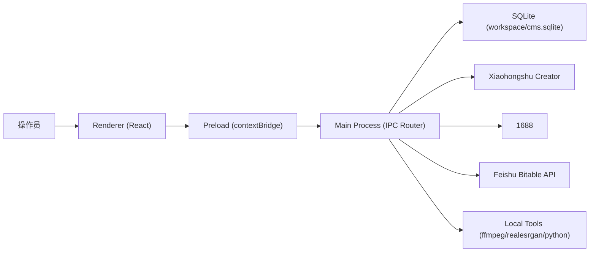
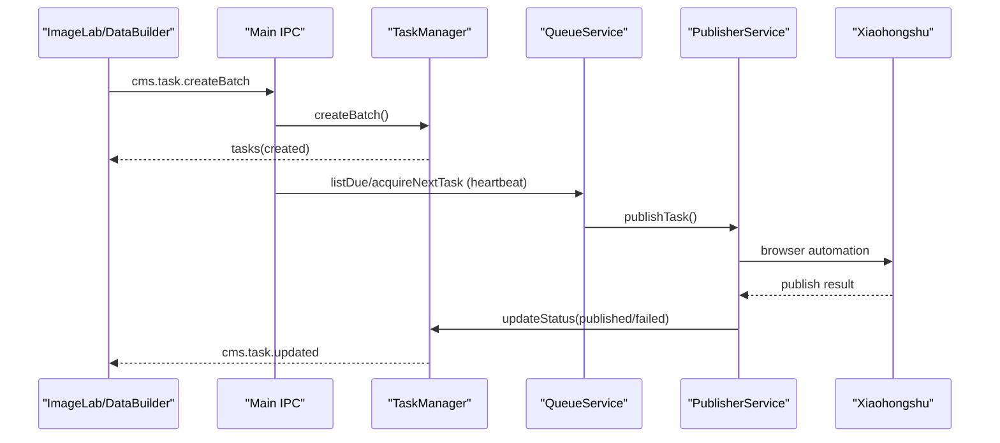
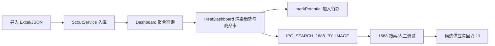
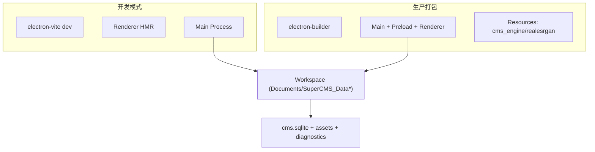

# Super CMS 技术架构文档（交接版）

- 文档版本: v1.1
- 最近更新时间: 2026-02-19
- 项目类型: Electron + React + TypeScript 桌面应用
- UI 技术判定: `electron`（依据 `package.json`、`src/main/index.ts`、`src/preload/index.ts`）

## 1. 系统上下文
Super CMS 是一个本地优先的桌面内容管理系统，核心围绕“素材处理 -> 任务生成 -> 队列排期 -> 自动发布 -> 选品分析”。

外部系统依赖:
- 小红书创作平台: 发布自动化、商品抓取。
- 1688: 图搜同款与供应商候选。
- 飞书多维表格: 图文任务同步与记录落库。
- 本地工具: `Real-ESRGAN`、Python 去印脚本或内置 `cms_engine`。

## 2. 模块边界
前后端边界清晰，采用 Electron 三层结构:

- 渲染层（`src/renderer`）:
  - 页面与交互编排（素材处理、数据工坊、媒体矩阵、选品、热度看板、设置）。
  - 本地状态管理（Zustand `useCmsStore`）。
- 预加载层（`src/preload` + `src/main/preload`）:
  - 暴露受控 API（`window.api`, `window.electronAPI`）。
  - 小红书自动化脚本与商品同步脚本注入。
- 主进程层（`src/main`）:
  - IPC 总线与业务服务聚合。
  - SQLite、队列、发布器、工作区、备份、诊断、选品服务。

## 3. 数据流
### 3.1 任务主链路

### 3.2 热度看板链路

## 4. API 契约
核心契约为 `ipcMain.handle/on` 与 preload 暴露函数。以下为关键接口簇（节选）：

| 分类 | IPC 通道 | 方向 | 说明 |
| --- | --- | --- | --- |
| 账号 | `GET /accounts`, `POST /accounts`, `POST /login-window` | Renderer -> Main | 账号增删查与登录窗口 |
| 商品 | `cms.product.list/save/sync` | Renderer -> Main | 商品列表、持久化、同步 |
| 任务 | `cms.task.createBatch/list/updateBatch/delete/updateStatus/cancelSchedule/importImages` | Renderer -> Main | 队列任务全生命周期 |
| 发布 | `publisher.publish`, `automation-log`, `publisher:progress` | 双向 | 小红书自动化发布与进度 |
| 素材处理 | `process-watermark`, `process-hd-upscale`, `process-grid-split`, `media:prepareVideoPreview` | Renderer -> Main | 图片/视频处理 |
| 选品同步 | `cms.scout.sync.*`, `cms.scout.keyword.*`, `cms.scout.product.list` | Renderer -> Main | JSON 导入与查询 |
| 热度看板 | `cms.scout.dashboard.*`, `IPC_FETCH_XHS_IMAGE`, `IPC_IMAGE_UPDATED`, `IPC_IMAGE_FETCH_FAILED`, `IPC_SEARCH_1688_BY_IMAGE` | 双向 | 趋势查询、封面抓取、失败回传、1688 图搜与绑定 |
| 工作区 | `workspace.getPath/pickPath/setPath/relaunch` | Renderer -> Main | 本地工作区管理 |
| 设置/飞书 | `get-config/save-config/get-feishu-config/feishu-*` | Renderer -> Main | 配置读写与飞书 API |

契约证据:
- `src/preload/index.ts` API 暴露定义。
- `src/main/index.ts` IPC 注册与参数归一化。

## 5. 数据库设计
### 5.1 主业务库（`cms.sqlite`）
- `accounts`: 账号标识、名称、分区键、状态、最近登录时间。
- `products`: 账号商品快照。
- `tasks`: 发布任务（媒体类型、素材、排期、状态、错误信息、重试列）。

关键索引/约束:
- `idx_tasks_status`, `idx_tasks_scheduledAt`, `idx_tasks_createdAt`。
- `accounts` 删除触发器联动删除任务。
- 增量兼容: `ALTER TABLE tasks ADD locked_at/retry_count`。

### 5.2 选品与看板库表（同库分表）
- `scout_keywords`, `scout_products`, `scout_sync_log`。
- `scout_dashboard_snapshot_rows`, `scout_dashboard_product_map`。
- `scout_dashboard_watchlist`, `scout_dashboard_cover_cache`。

数据特征:
- 快照维度按 `snapshot_date + product_key` 复合主键。
- 监控指标（加购、评分、店铺粉丝）支持趋势聚合。
- `deleteDashboardSnapshot` 以 `imported_at` 批次为主键删除快照，并级联清理失效 `watchlist/product_map/cover_cache`。
- `bindDashboardSupplier` 将候选供应商写回 `scout_dashboard_watchlist`（`supplier1_*`, `profit1`, `best_profit_amount`, `sourcing_status`）。

## 6. 部署拓扑
运行形态分开发与打包:

补充:
- 通过 `powerSaveBlocker.prevent-app-suspension` 保持排期执行。
- macOS 关闭窗口默认隐藏而非退出，支持后台任务继续。

## 7. 监控告警
当前以“日志 + 诊断文件”为主：
- 渲染层日志:
  - `useCmsStore.logs` + DEV `ConsolePanel`。
- 处理日志:
  - `process-log` 通道回传子进程 stdout/stderr。
- 发布失败诊断:
  - `DiagnosticsService` 保存截图和网络请求日志至 `workspace/diagnostics`。
- 队列稳定性:
  - `QueueService.markStalledTasksAsFailed/recoverStalledTasks`。

现状结论:
- 已具备本地诊断能力。
- 未见外部 APM/告警平台接入（待确认）。

## 8. 安全与权限
已实现控制:
- `openExternal` 仅允许 `http/https`。
- `safe-file://` 自定义协议并支持范围请求，避免直接暴露任意文件 URL。
- 发布与商品同步窗口启用独立 `partition`，隔离账号态。
- 飞书密钥由主进程保存与调用，渲染层不直连远端 API。

注意点:
- 主窗口 `sandbox: false`，安全边界依赖 `contextIsolation + preload` 约束。
- 配置存储在本地 `electron-store`，需依赖终端主机安全策略。

脱敏说明:
- 文档仅保留字段名（`appId/appSecret/baseToken/tableId`），不记录真实值。

## 9. 性能容量
已见性能控制策略:
- GPU/子进程串行: `p-limit(1)` 避免并发压垮图像处理。
- 调度心跳: 每 5 秒轮询到期任务并按账号去重执行。
- 视频预览转码缓存: `temp_previews` + 基于文件哈希复用。
- 大列表虚拟化: 数据工坊任务列表使用 `react-virtuoso`。

容量风险:
- 图片全流程为单线程串行，吞吐受限。
- 1688 图搜存在反爬与人工介入分支，自动化成功率受外部环境影响。

## 10. 已知技术债与演进建议
- [可维护性] IPC 字符串常量分散在 `src/main/index.ts` 与 `src/preload/index.ts`，建议抽离共享契约层。
- [可观测性] 建议在主流程加入结构化事件埋点（任务创建、排期、发布结果、搜同款结果）。
- [安全性] 评估主窗口 `sandbox` 收敛路径，至少对新窗口默认开启更严格策略。
- [产品一致性] `UploadManager` 入口已隐藏但代码仍活跃，建议明确保留或下线策略。
- [调试治理] 抓图/搜同款调试开关目前依赖进程环境变量，建议增加持久化配置与角色权限控制。

## 11. 本次变更摘要
- 对齐 `origin/main` 最新修复：待排期池标题长度校验前移到排期入口，避免非法任务进入调度队列。
- 发布稳定性补充：上传就绪守卫 + 上传中重试拦截，降低图文发布中断率。
- 失败任务治理补充：统一失败展示并在重试耗尽后回退待排期池，便于人工二次处理。
- 本次巡检同步刷新文档审计产物：`docs/_evidence.json`、`docs/_update-report.md`。

<!-- ARCH-SECTION:BEGIN -->
### 人工补充区
- 预留给架构评审记录、版本演进决议和容量预算更新。
<!-- ARCH-SECTION:END -->
