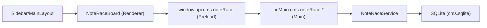
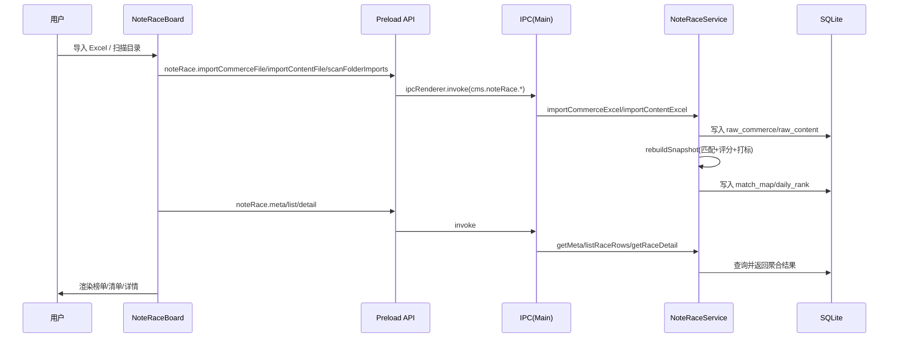

# 数据赛马场模块梳理（NoteRaceBoard）

## 1. 模块定位
- 目标：把“商品笔记数据 + 笔记列表明细”合并成可执行的赛马监控面板，输出每日重点跟进清单、风险提示和单条笔记诊断信息。
- UI 名称：侧边栏 `数据赛马场`。
- 代码入口：
  - `src/renderer/src/components/layout/Sidebar.tsx:37`
  - `src/renderer/src/components/layout/MainLayout.tsx:28`
  - `src/renderer/src/modules/NoteRaceBoard/index.tsx:375`

## 2. 当前功能描述

### 2.1 数据导入与监控
- 手动导入两类 Excel：
  - 商品笔记表：`导入商品笔记表`
  - 笔记列表表：`导入笔记列表表`
- 导入触发链路：
  - 渲染层按钮触发：`src/renderer/src/modules/NoteRaceBoard/index.tsx:611`
  - 预加载桥接 API：`src/preload/index.ts:743`
  - 主进程 IPC：`src/main/index.ts:3906`
  - 服务解析/入库：`src/main/services/noteRaceService.ts:522`
- 目录扫描导入：
  - 可选监控目录，支持手动扫描和自动轮询（15 秒）
  - 自动监控状态与游标持久化在 `localStorage`
  - 文件名规则：
    - 包含 `商品笔记数据` -> 商品导入
    - 包含 `笔记列表明细` 或 `笔记列表` -> 内容导入
  - 核心实现：
    - 前端扫描触发：`src/renderer/src/modules/NoteRaceBoard/index.tsx:648`
    - 主进程扫描逻辑：`src/main/index.ts:3971`

### 2.2 监控总览与筛选
- 快照维度：支持按 `snapshotDate` 切换。
- 筛选维度：账号、体裁（全部/图文/视频）。
- 聚焦视图：
  - `全部`
  - `机会`（起飞、长尾复活、或趋势分增量高）
  - `风险`（风险、掉速、或趋势分增量低）
- 关键行为：
  - 拉取元信息与日期：`meta()`（`src/renderer/src/modules/NoteRaceBoard/index.tsx:410`）
  - 拉取榜单数据：`list()`（`src/renderer/src/modules/NoteRaceBoard/index.tsx:421`）
  - 机会/风险视图仅在至少 2 日数据时启用：`src/renderer/src/modules/NoteRaceBoard/index.tsx:403`

### 2.3 排名清单与行动建议
- 监控列表展示 Top 12。
- 同时生成“今日必做清单（Top 10）”，按 `P0/P1/P2` 优先级排序。
- Day1 场景和连续多日场景使用不同建议策略：
  - Day1：保守策略，标注低置信
  - Day2+：引入趋势与风险信号，给出更强动作建议
- 关键实现：
  - `buildActionItem`：`src/renderer/src/modules/NoteRaceBoard/index.tsx:164`
  - `buildActionItemDay1`：`src/renderer/src/modules/NoteRaceBoard/index.tsx:237`

### 2.4 详情诊断能力
- 点击榜单行后读取单条详情，输出：
  - 基础信息（笔记 ID、账号、发布时间、体裁、关联商品、阶段）
  - 内容漏斗（曝光 -> 观看/阅读 -> 互动 -> 商品点击）
  - 商品漏斗（商品点击 -> 加购 -> 支付 -> 退款）
  - 7 日阅读 sparkline
  - 增量指标（d阅读、d点击、加速度、稳定性）
  - 阶段进度（S1-S5）
- 关键实现：
  - 详情请求：`src/renderer/src/modules/NoteRaceBoard/index.tsx:490`
  - 后端聚合详情：`src/main/services/noteRaceService.ts:886`

### 2.5 数据质量提示
- 按数据阶段分级：
  - `EMPTY`：无快照，提示先导入数据
  - `DAY1`：仅 1 日数据，趋势提示“样本不足”
  - `DAY2_PLUS`：启用趋势与机会/风险聚焦
- 匹配率预警：
  - `< 0.5`：严重偏低
  - `< 0.7`：偏低
- 关键实现：`src/renderer/src/modules/NoteRaceBoard/index.tsx:573`

## 3. 技术架构

### 3.1 分层结构
1. Renderer（React）
   - 页面、状态、交互、筛选、可视化
   - 文件：`src/renderer/src/modules/NoteRaceBoard/index.tsx`
2. Preload（contextBridge）
   - 暴露受控 API：`window.api.cms.noteRace.*`
   - 文件：`src/preload/index.ts:743`
3. Main（IPC）
   - 文件选择对话框、目录扫描、参数校验
   - 文件：`src/main/index.ts:3906`
4. Service（领域逻辑）
   - Excel 解析、匹配、评分、标签、榜单重建
   - 文件：`src/main/services/noteRaceService.ts:405`
5. Storage（SQLite）
   - 原始数据表 + 匹配表 + 日榜表
   - 初始化：`src/main/services/noteRaceService.ts:412`

### 3.2 模块关系图

### 3.3 端到端数据流

## 4. 评分与标签核心逻辑

### 4.1 匹配策略（商品行 -> 内容行）
- `title_time_exact`：标题 + 时间精确匹配，置信度 `1.0`
- `title_time_nearest`：标题 + 时间近邻，置信度 `0.85`
- `title_unique`：仅标题唯一匹配，置信度 `0.75`
- `unmatched`：未匹配，置信度 `0`
- 实现：`src/main/services/noteRaceService.ts:1040`

### 4.2 趋势增量与得分
- 趋势增量：
  - `trendDeltaRaw = dRead*0.02 + dClick*0.3 + dOrder*2 + (acceleration-1)*2`
  - 结果截断到 `[-9.9, 9.9]`
- 三路原始分：
  - `trendRaw`（趋势）
  - `contentRaw`（内容表现）
  - `commerceRaw`（商品转化）
- 归一化后总分：
  - `score = 0.55*trend + 0.30*content + 0.15*commerce - refundPenalty`
  - `refundPenalty = clamp(refundRate * 20, 0, 20)`
- 实现：`src/main/services/noteRaceService.ts:1173`

### 4.3 标签规则
- 长尾复活：`ageDays > 30 && dRead >= 20`
- 风险：退款率高或明显掉速且分值低
- 起飞：`trendDelta >= 3`
- 掉速：`trendDelta <= -2.5` 且未触发更高风险
- 维稳：其余情况
- 实现：`src/main/services/noteRaceService.ts:349`

### 4.4 阶段规则（S1-S4）
- S4 成交：支付订单 >= 2 或支付金额 >= 100
- S3 成交：点击 >= 10 或支付订单 >= 1
- S2 导流：阅读 >= 200 或点击 >= 3
- S1 起量：其余情况
- 实现：`src/main/services/noteRaceService.ts:360`

## 5. 数据库设计（NoteRace 相关）
- `note_race_raw_commerce`
  - 商品侧原始行，主键 `(snapshot_date, note_key)`
  - 指标包含阅读、点击、支付、退款等
- `note_race_raw_content`
  - 内容侧原始行，主键 `(snapshot_date, row_id)`
  - 指标包含曝光、观看、封面点击率、互动等
- `note_race_match_map`
  - 商品行到内容行的匹配关系与置信度
- `note_race_daily_rank`
  - 每日榜单快照（排名、标签、分数、信号、阶段、增量）
- 建表与索引：`src/main/services/noteRaceService.ts:412`

## 6. IPC 契约（对前端）
- `cms.noteRace.importCommerceFile(payload?: { filePath?: string })`
- `cms.noteRace.importContentFile(payload?: { filePath?: string })`
- `cms.noteRace.scanFolderImports(payload: { dirPath: string; sinceMs?: number })`
- `cms.noteRace.meta()`
- `cms.noteRace.list(payload?: { snapshotDate?: string; account?: string; noteType?: '全部'|'图文'|'视频'; limit?: number })`
- `cms.noteRace.detail(payload: { snapshotDate?: string; noteKey?: string })`
- 定义位置：`src/preload/index.ts:743`，处理位置：`src/main/index.ts:3906`

## 7. 当前实现边界与注意点
- 目录扫描依赖文件名关键词判断类型，命名不规范会被跳过。
- 短日期文件名（如 `3.1`）会默认补当前年份。
- Day1 阶段趋势能力受限，行动建议为试探性策略。
- 匹配率低时会提示“先修复数据后解读排名”，但目前未自动提供修复向导。

## 8. 证据清单（关键结论）
- UI 入口与挂载：`src/renderer/src/components/layout/Sidebar.tsx:37`，`src/renderer/src/components/layout/MainLayout.tsx:28`
- 页面交互与策略：`src/renderer/src/modules/NoteRaceBoard/index.tsx:375`
- 预加载 API：`src/preload/index.ts:743`
- IPC 编排：`src/main/index.ts:3906`
- 算法与落库：`src/main/services/noteRaceService.ts:405`
- SQLite 初始化上下文：`src/main/index.ts:1046`，`src/main/services/sqliteService.ts:80`

